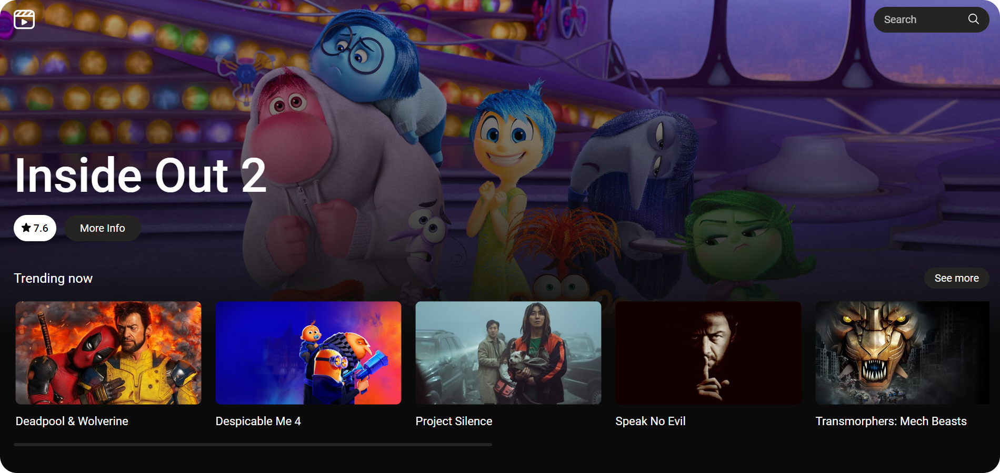

# MovieDB

**MovieDB** is a simple movie database application built with **React**. It allows users to explore information about different movies and TV shows using data fetched from **The Movie Database (TMDB) API**. The project uses **Tailwind CSS** for styling, making the UI responsive and modern.

## Screenshots




## Features

- Search for movies and TV shows from TMDB's vast collection
- View details including title, release date, runtime, overview and rating
- Responsive design for mobile and desktop devices

## Getting Started

### 1. Clone the Repository

```bash
git clone https://github.com/Sulkhans/MovieDB.git
cd MovieDB
```

### 2. Install Dependencies

```bash
npm install
# or
yarn install
```

### 3. Configure Enviroment Variables

You will need to add your **TMDB API access token** to the project.

Create a `.env.local` file in the root directory of the project and add the following:

```bash
VITE_TMDB_API_ACCESS_TOKEN=<your_tmdb_api_access_token>
```

### 4. Run the Project

After setting up the environment variables, you can start the development server:

```bash
npm run dev
# or
yarn dev
```

Open http://localhost:5173 to view it in the browser.
